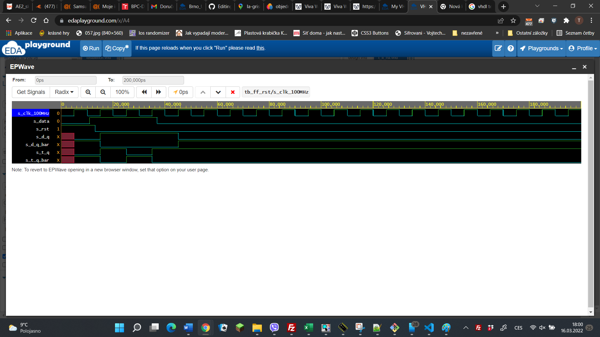
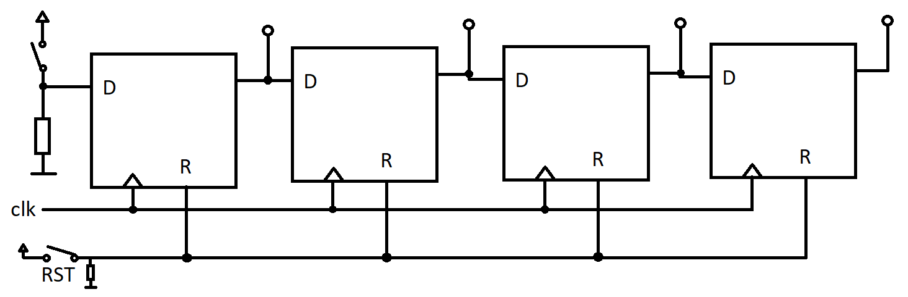

# Lab 5: Tomas Uchytil

### Flip-flops

1. Listing of VHDL architecture for T-type flip-flop. Always use syntax highlighting, meaningful comments, and follow VHDL guidelines:

```vhdl
architecture Behavioral of t_ff_rst is
signal q_n        : std_logic;
begin
    --------------------------------------------------------
    -- p_d_ff_rst:
    -- D type flip-flop with a high-active sync reset,
    -- rising-edge clk.
    -- q(n+1) = d
    --------------------------------------------------------
    p_t_ff_rst : process(clk)
    begin
        if rising_edge(clk) then  -- Synchronous process
            if (rst = '1') then
                q     <= '0';
                q_bar <= '1';
                q_n   <= '0';
            else
                q     <= (t and not q_n) or (not t and q_n);
                q_bar <= not((t and not q_n) or (not t and q_n));
                q_n <= (t and not q_n) or (not t and q_n);
            end if;
        end if;
    end process p_t_ff_rst;
end architecture Behavioral;
```

2. Screenshot with simulated time waveforms. Try to simulate both flip-flops in a single testbench with a maximum duration of 200 ns, including reset. Always display all inputs and outputs (display the inputs at the top of the image, the outputs below them) at the appropriate time scale!

   
   *při domácí kontrole jsem zjistil, že jsem v laboratoři stáhnul z PC špatný snímek obrazovky. Vkládám výsledek simulace z EDAplayground. 

### Shift register

1. Image of the shift register `top` level schematic. The image can be drawn on a computer or by hand. Always name all inputs, outputs, components and internal signals!

   
